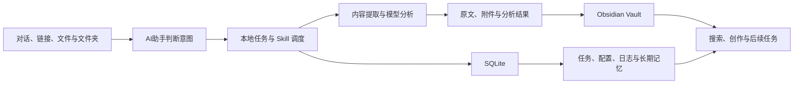
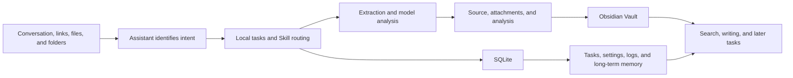

# 云枢 Yunspire

我做云枢，是因为日常收集的网页、文档、图片、音视频和 Obsidian 笔记越来越分散。它不是另一个在线笔记服务，而是一套运行在本机的桌面 Agent：AI助手理解我的自然语言，调用应用里的工具完成采集、整理、搜索、创作和定时任务，Obsidian 与 SQLite 分别保存知识内容和运行状态。

English: [About Yunspire](#about-yunspire)

## 下载与安装

安装包放在 [GitHub Releases](https://github.com/Leo-sail/yunspire/releases/latest)，不需要从源码目录中寻找。当前版本提供：

- **macOS 13 及以上**：[下载 macOS Universal 安装包](https://github.com/Leo-sail/yunspire/releases/latest/download/Yunspire_0.1.0_macOS-universal_unsigned.dmg)，同时支持 Apple Silicon 和 Intel Mac。文档与媒体本地处理目前需要 Python 3 和 Apple Command Line Tools；先运行 `python3 --version` 检查 Python 3，缺失时从 [python.org](https://www.python.org/downloads/macos/) 安装，再运行 `xcode-select --install` 安装命令行工具。
- **Windows 10/11 x64**：[下载 Windows x64 安装包](https://github.com/Leo-sail/yunspire/releases/latest/download/Yunspire_0.1.0_Windows-x64_unsigned-setup.exe)。安装包已包含 Python 运行时及预编译的本地执行器。
- **完整性校验**：[下载 SHA-256 清单](https://github.com/Leo-sail/yunspire/releases/latest/download/SHA256SUMS.txt)，确认安装包的 SHA-256 与清单一致。

```powershell
# Windows PowerShell
Get-FileHash .\Yunspire_0.1.0_Windows-x64_unsigned-setup.exe -Algorithm SHA256
```

```bash
# macOS
shasum -a 256 Yunspire_0.1.0_macOS-universal_unsigned.dmg
```

当前安装包尚未进行 Apple 公证或 Windows 代码签名。请只从本仓库的 Release 页面下载并先核对哈希。Windows 可能显示“未知发布者”；macOS 可能需要在“系统设置 → 隐私与安全性”中确认打开。不要关闭操作系统的安全检查。

## 云枢的优势

- **数据留在本机**：Obsidian Vault、任务、配置、操作日志和长期记忆保存在设备上。只有调用用户配置的模型时，当前任务所需内容才会发送给对应供应商。
- **对话之后继续执行**：AI助手不仅回复文字，还会判断意图、调用本地 Skill 和应用能力，持续运行到任务完成，再回到同一对话交付结果。
- **保留原始信息**：网页、Office 文档、PDF、图片、音频和视频会先按结构提取，再由模型分析。原文、附件和整理结果分别保存，不会只剩一段摘要。
- **Obsidian 是知识源**：Markdown、附件、属性和链接以 Vault 为准；SQLite 负责运行状态和记忆，本地索引可以随时重建。
- **模型按任务分工**：可以混用不同供应商，并分别指定对话、内容分析和图片生成模型，不必把所有工作交给同一个模型。
- **过程可以追踪**：长期记忆保留必要上下文，操作日志记录系统实际执行过什么，定时任务也有明确状态。
- **跨平台本地处理**：macOS 与 Windows 使用各自的本地适配器处理 PDF、图片、视频帧和语音转写，核心工作流保持一致。

## 它能做什么

- 在 AI助手中对话，并直接查询、整理和管理本地 Obsidian 知识库。
- 读取网页、视频、音频、Word、Excel、PowerPoint、PDF、Markdown、文本及本地文件夹。
- 让已配置的模型参与正文、图片、音频和视频画面的分析，再保存原文、附件和整理结果。
- 同时配置多个模型供应商，并分别指定对话、内容分析和图片生成模型。
- 创建定时采集与报告任务，在任务页查看进度，在操作日志中追踪结果。
- 记录对话和操作形成长期记忆，让后续任务保留必要上下文。
- 在 macOS 和 Windows 上使用本地 PDF 渲染、视频关键帧提取与语音转写。

## 运行方式



Obsidian 是文档、附件、属性和链接的权威来源。SQLite 保存任务状态、模型配置、操作日志和长期记忆；本地索引可以从 Vault 重新建立。

首次使用且没有指定 Vault 时，云枢会在用户选择的位置初始化 `Agent 库` 和 `个人库`。指定其他 Vault 后，搜索和写入以用户当前选择为准。

## 第一次打开

第一次启动会出现一次云枢工作授权。授权状态保存在本机数据库，之后使用同一份应用数据不会重复询问。macOS 或 Windows 仍会在首次使用文件、麦克风或屏幕等能力时显示各自的系统权限窗口。

完成授权后：

1. 在“设置 → 知识库”扫描并选择 Obsidian Vault。
2. 在“设置 → API 配置”添加供应商，读取模型列表并指定用途。
3. 回到 AI助手，用自然语言发起查询、采集、创作或定时任务。

## 使用习惯

- 直接说明目标和保存位置，例如“整理这个 PDF，原文放个人库，分析结果放 Agent 库”。
- 文件和图片可以拖进 AI助手输入框，并与消息一起发送。
- 输入 `/` 可以选择内置命令；`/clear` 会清空当前对话上下文。
- 采集任务由 AI助手创建和修改；任务页只显示定时任务，其他执行过程在操作日志中查看。
- 删除笔记、文件夹或 Vault 时，内容先进入云枢回收区，物理删除仍需手动确认。

## 本地开发

需要 Node.js 20.19+ 或 22.12+、Rust 1.88+ 和 Tauri 2。

```bash
npm ci
npm run dev
```

构建桌面应用：

```bash
npm run tauri:build
```

Windows 构建会下载固定版本的官方 CPython 嵌入式运行时，并用 MSVC 编译 PDF、图片、视频和语音适配器。构建产物不包含用户 Vault、API 密钥或本机 SQLite 数据。

## 数据与权限

网页、文件、图片、音视频转写和外部消息都按不可信内容处理，不能修改系统规则或自行获得工具权限。模型只能通过云枢提供的受控能力访问数据。

API 密钥和应用数据库保存在设备上。调用外部模型或读取外部来源时，云枢遵循用户配置和来源授权，不绕过登录、Cookie、验证码、DRM 或平台访问控制。

## 许可

云枢第一方代码、算法、界面、文档和品牌资产按仓库内的非商业许可发布。个人学习、非营利研究、教学和评估可以使用；商业部署、收费服务、托管、SaaS、转售或商业集成需要事先取得书面授权。

- [许可协议 / License](LICENSE)
- [第三方声明 / Third-party notices](NOTICE)
- [安全报告 / Security](SECURITY.md)

联系：`leochang210@gmail.com`

---

## About Yunspire

I built Yunspire because the web pages, documents, images, media, and Obsidian notes I collect every day had become scattered across too many places. Yunspire is not another hosted note service. It is a local desktop agent: the assistant understands natural-language requests, uses the application's tools for capture, organization, search, writing, and scheduled work, while Obsidian and SQLite store knowledge and runtime state.

## Download and Install

Installable builds are available on [GitHub Releases](https://github.com/Leo-sail/yunspire/releases/latest); they are not stored among the repository source files.

- **macOS 13 or later:** [download the macOS Universal installer](https://github.com/Leo-sail/yunspire/releases/latest/download/Yunspire_0.1.0_macOS-universal_unsigned.dmg). It supports both Apple Silicon and Intel Macs. Local document and media processing currently requires Python 3 and Apple Command Line Tools. Run `python3 --version` first; if Python 3 is missing, install it from [python.org](https://www.python.org/downloads/macos/), then run `xcode-select --install` to install the command-line tools.
- **Windows 10/11 x64:** [download the Windows x64 installer](https://github.com/Leo-sail/yunspire/releases/latest/download/Yunspire_0.1.0_Windows-x64_unsigned-setup.exe). The installer includes the Python runtime and precompiled local helpers.
- **Integrity check:** [download the SHA-256 manifest](https://github.com/Leo-sail/yunspire/releases/latest/download/SHA256SUMS.txt) and compare the installer's SHA-256 with its entry.

```powershell
# Windows PowerShell
Get-FileHash .\Yunspire_0.1.0_Windows-x64_unsigned-setup.exe -Algorithm SHA256
```

```bash
# macOS
shasum -a 256 Yunspire_0.1.0_macOS-universal_unsigned.dmg
```

These installers are not Apple-notarized or Windows code-signed. Download them only from this repository and verify the checksum first. Windows may show an unknown-publisher warning; macOS may require approval under **System Settings → Privacy & Security**. Do not disable operating-system security checks.

## Yunspire's Advantages

- **Data stays local:** Obsidian vaults, tasks, settings, operation logs, and long-term memory remain on the device. Content is sent to a provider only when a configured model is used for the current task.
- **Conversation continues into execution:** the assistant identifies intent, invokes local Skills and application capabilities, runs until the work finishes, and reports the result in the same conversation.
- **Source material is preserved:** web pages, Office documents, PDFs, images, audio, and video are structurally extracted before model analysis. Source content, attachments, and organized results are stored separately instead of being reduced to a summary.
- **Obsidian remains the knowledge source:** Markdown, attachments, properties, and links live in the vault. SQLite holds runtime state and memory, while local indexes can be rebuilt.
- **Models have separate roles:** providers can be mixed, with different selected models for conversation, content analysis, and image generation.
- **Work remains traceable:** long-term memory keeps useful context, operation logs show what the system actually did, and scheduled tasks expose their state.
- **Native processing on both platforms:** macOS and Windows use platform-specific local adapters for PDFs, images, video frames, and speech transcription while sharing the same core workflow.

## What It Does

- Converses with the user and works directly with local Obsidian vaults.
- Reads web pages, video, audio, Word, Excel, PowerPoint, PDF, Markdown, text, and local folders.
- Uses configured models to analyze text, images, audio, and video frames before saving source material, attachments, and structured results.
- Supports multiple model providers and separate model assignments for chat, content analysis, and image generation.
- Runs scheduled capture and reporting tasks with progress and operation logs.
- Keeps long-term memory from conversations and operations.
- Provides local PDF rendering, video frame extraction, and speech transcription on macOS and Windows.

## How It Works



Obsidian remains the source of truth for documents, attachments, properties, and links. SQLite stores task state, model settings, operation logs, and long-term memory; local indexes can be rebuilt from the vault.

When no vault has been selected, Yunspire initializes `Agent 库` and `个人库` in a location chosen by the user. Once another vault is selected, searches and writes follow that selection.

## First Launch

Yunspire asks once for its own working permission and stores that choice in the local database. macOS and Windows permissions for files, microphone, screen access, and similar capabilities remain controlled by the operating system.

After authorization:

1. Scan and select Obsidian vaults under Settings → Knowledge Base.
2. Add providers under Settings → API Configuration, fetch models, and assign their roles.
3. Return to the assistant and request a search, capture, writing task, or schedule in plain language.

## Working Tips

- State the goal and destination directly, for example: “Organize this PDF, save the source in my personal vault, and put the analysis in the Agent vault.”
- Drag files and images into the assistant input and send them with the message.
- Type `/` to choose a built-in command. `/clear` removes the current conversation context.
- Capture tasks are created and edited through the assistant. The Tasks page shows scheduled tasks only; other execution details appear in Operation Logs.
- Deleting a note, folder, or vault moves it to Yunspire's recycle area first. Physical deletion still requires manual confirmation.

## Development

Node.js 20.19+ or 22.12+, Rust 1.88+, and Tauri 2 are required.

```bash
npm ci
npm run dev
npm run tauri:build
```

The Windows build downloads a pinned official CPython embeddable runtime and compiles the PDF, image, video, and speech adapters with MSVC. User vaults, API keys, and local SQLite data are never included in build artifacts.

## Data and Permissions

Web pages, files, images, transcripts, and external messages are treated as untrusted data. They cannot change system rules or grant themselves tool access. Models can only access data through capabilities exposed by Yunspire.

API keys and the application database stay on the device. Yunspire follows configured provider and source permissions and does not bypass logins, cookies, CAPTCHAs, DRM, or platform access controls.

## License

Yunspire's first-party code, algorithms, interface, documentation, and brand assets are distributed under the repository's non-commercial license. Personal learning, non-profit research, teaching, and evaluation are permitted. Commercial deployment, paid services, hosting, SaaS, resale, or commercial integration require prior written authorization.

- [License](LICENSE)
- [Third-party notices](NOTICE)
- [Security reporting](SECURITY.md)

Contact: `leochang210@gmail.com`
