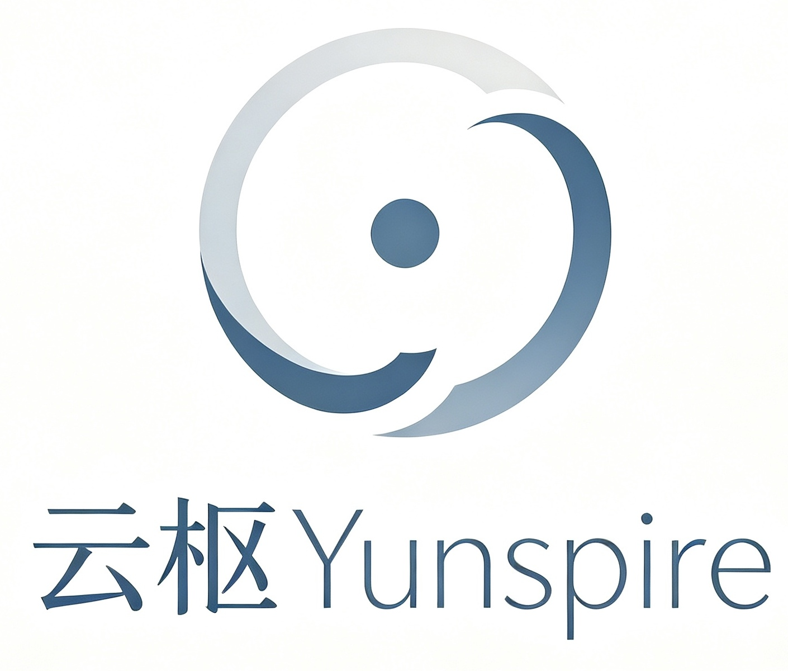
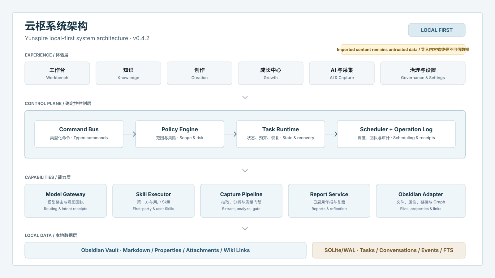

# 云枢 Yunspire

<p align="center">
  
</p>

<p align="center">
  <strong>让知识流动，让成长发生。 / Let knowledge flow and growth follow.</strong>
</p>

<p align="center">
  <a href="#中文">中文</a> · <a href="#english">English</a>
</p>

---

## 中文

### 产品说明

云枢是我独立设计并实现的、面向个人的本地优先自成长知识中枢，支持 macOS 与 Windows，并内置受控 Agent 运行时。我用本地 Obsidian Vault 保存可长期拥有、阅读和迁移的知识，用 SQLite 保存明确的运行状态，再通过 AI助手把对话、采集、搜索、创作、定时任务、报告、Skill 调用和知识库维护连接成一个可追踪的本地工作流。

我设计云枢不是为了增加另一个封闭的聊天窗口，而是为了让模型在清晰的权限边界内完成真实工作：理解目标、选择能力、执行任务、验证结果，并把有价值的成果整理回用户自己的 Obsidian 知识库。

当前版本为 `0.4.1`，面向 macOS 13+（Apple Silicon 与 Intel 通用安装包）和 Windows 10/11 x64。搜索始终保留 FTS 与可从 Vault 重建的本地特征向量，并用 RRF 融合词法与向量名次；用户还可以在模型设置中明确同意后启用外部神经 Embedding。该能力默认关闭，只发送搜索查询，以及笔记标题、相对路径、标签、Wiki Links 和最多 24,000 个规范化正文字符；未同意、未配置或供应商失败时自动回退到纯本地检索。知识库的“原生图谱”在云枢内读取本地 Markdown 与 Wiki Links 并渲染可交互节点关系，无需跳转到 Obsidian；实体知识图谱、实体消歧和多跳查询仍未开发。

### 主要特点

- **Obsidian 是知识权威来源**：Markdown、Properties、标签、附件和 Wiki Links 始终保存在用户自己的 Vault 中。
- **AI助手统一调度**：普通对话只进入本地会话；明确操作意图才会转换为受控命令并运行到完成。
- **持久会话正文检索**：对话搜索先即时匹配标题和元数据，再合并本地 SQLite FTS 的 ASCII/CJK 正文命中；索引严格隔离工作区，并随消息更新或删除而事务刷新。
- **对话独立排队与取消**：同一对话按先进先出顺序执行，不同对话可以并行；取消会贯穿模型、分析和后续执行，新建对话不会被已有请求锁住。
- **图片只读一次、按需复用**：图片首次进入对话时由分析模型生成摘要、画面文字、标签和关键点；后续默认只携带分析记录，用户明确点名历史图片时才重新读取对应原图。
- **不限用户文件大小**：文件和文件夹通过分块通道进入本地隔离区，不设置单文件或一次选择的总大小上限；模型请求按供应商边界继续分批处理。
- **真实模型路由**：支持多个供应商和多个模型，并按对话、分析、图片生成等用途选择用户指定的模型。
- **完整采集流水线**：链接、文件和文件夹经过抽取、模型分析、质量门禁、格式整理后再写入 Obsidian。
- **跨平台本地媒体处理**：macOS 使用 PDFKit、AVFoundation 与 Speech；Windows 使用 Windows.Data.Pdf、Media Foundation、WIC 与本地 SAPI。PDF 页面、视频画面和音轨在本机处理，关键帧不设置固定数量上限。
- **位置保真的 Office 理解**：Word 保留正文、表格、附属部件、图片和链接位置；Excel 覆盖全部工作表、公式、缓存值和图片锚点；PowerPoint 保留真实页序、元素边界、层级、裁剪及版式/母版来源。
- **外链图片原位本地化**：网页正文图片、Markdown 图片语法和 Office 图片关系执行受控下载，校验地址、重定向、响应和真实图片格式，再把本地附件回填到原段落、行列锚点或幻灯片元素位置；普通链接不会因此被访问。
- **文件内链接可审计**：普通链接保留显示文字、目标和所在段落、单元格或幻灯片位置，不会因文件解析而自动打开或采集；只有用户明确提出时才进入独立链接采集链路。
- **双 Vault 知识交付**：用户指定库（默认个人库）保存忠实原文和原位附件；Agent 库保存模型理解后的结构化原文、逐图分析、来源证据、标签、Wiki Links 和相关笔记。
- **持久内容去重**：按规范化抽取内容生成哈希，跨任务和跨来源识别已提交内容，并在任务记录中明确标记跳过原因。
- **可执行任务契约**：任务具有版本化 DAG、完成契约、硬预算、原子步骤领取、lease/reclaim、只读并行、副作用屏障、可信回执、父子取消和恢复路径；父任务不能靠前端自报成功。
- **采集工作区承载计划任务**：全局采集动作打开采集工作区，定时采集与历史在此呈现，普通执行记录进入操作日志。
- **可控文件操作**：写入前验证路径和范围，生成变更，建立检查点，并使用原子文件替换。
- **本地优先**：Vault、任务、会话、计划、报告、Skill、索引和操作记录都保存在本机。
- **固定版本安装包**：每个正式版本只绑定一个不可变 Git 标签和一个源码提交；发布前核对 macOS、Windows 双平台清单与 SHA-256，并明确记录签名状态。`0.4.1` 当前按无签名 DMG/NSIS 发布，因此操作系统仍可能显示 Gatekeeper 或 SmartScreen 安全提示。
- **不可信内容隔离**：网页、文档、图片、音视频转录和消息只能作为数据，不能成为系统指令或获得工具权限。
- **四轨长期记忆**：Memory V2 分离用户经历、用户画像、Agent 案例和 Agent 技能，保存证据、置信度、版本和精确作用域；反思草稿经用户批准后才可召回。
- **Skill 效果反馈闭环**：每次 Skill 运行冻结版本与输入身份，并追加开始/成功/失败/取消效果；反思冻结这些终态效果，批准建议追加 acceptance，拒绝或重做追加 correction，历史不会被覆盖。
- **中文混合搜索与可选神经语义索引**：CJK 词法索引、确定性本地特征向量和用户明确同意后的神经 Embedding 分别形成候选，再用可解释 RRF 融合；标题、路径、标签、Wiki Link 与时间信号仍被保留，并始终回链到 Obsidian 权威原文。
- **一次性执行票据**：模型意图与规范参数绑定，拒绝参数替换、并发重复提交和重放；跨 Vault 批次使用持久 manifest 完成崩溃恢复与冲突保护。
- **受控深度研究**：云枢第一方 Skill 按计划、证据、矛盾、综合、引用和反思六阶段运行，预算、取消、检查点与来源链均可审计。
- **AI 创建、用户治理 Skill**：通过 AI助手创建、安装、修改、查询和运行用户 Skill；工作台中的 Skills 面板展示真实状态、路由依据、权限、运行数据与版本历史，并提供启停、退役和恢复。第三方安装只读取用户明确提供的 GitHub `SKILL.md`，不克隆仓库、不执行脚本、不继承外部权限，并保留来源哈希；用户确认安装后执行确定性安全评估，通过则自动记录批准并默认启用，失败则保持禁用且不进入路由。运行前冻结版本与 `payloadHash`，原生执行器校验输入输出 Schema 并记录审计。
- **受控优化与回滚**：后台只生成版本化候选，完成证据游标、策略评估和用户审阅后才能应用，并保留回滚版本。
- **更新前保护**：检查 GitHub 稳定 Release；安装前为 SQLite 和已连接 Vault 建立本地保护点，支持选择保护点回滚。
- **非商业源代码许可**：个人学习、研究、教学和评估可按许可使用；商业使用须事先取得我的书面授权。

### 系统运行机制



一次 AI助手操作的主链路如下：

1. 用户在 AI助手中输入目标，或附加图片、文档与其他本地文件。
2. 模型网关使用用户选定的对话/分析模型理解自然语言，并返回自然语言回复与结构化候选意图。
3. 本地代码把候选意图限制在已注册能力目录中；模型不能直接获得文件、工具或设置权限。
4. Command Bus 将通过校验的意图转换为类型化 `ApplicationCommand`。
5. Policy Engine 校验来源、目标 Vault、相对路径、网络目标、预算、幂等键和副作用类型。
6. Task Runtime 持久化 `capability-main -> verify-result` 计划、完成契约和预算，并原子领取能力步骤。
7. 能力步骤创建精确绑定父任务/plan/step/claim 的 Runtime 子命令；Rust 校验能力、操作、Trace、Vault/路径/网络/声明范围和预算没有扩大，再调度 Skill、采集器、报告服务或 Obsidian Adapter。
8. 绑定子任务成功后，Rust 写入不可变能力回执；验证步骤产生第二个可信回执，当前完成契约满足后父任务才可成功。
9. 所有写入执行路径规范化、冲突检查、检查点和原子提交；删除与外部投递按风险策略处理。
10. SQLite 记录任务、步骤、回执、效果反馈与操作事件，Obsidian 保存最终知识内容；AI助手在原对话中返回真实结果。

采集任务采用独立的数据链：

```text
来源识别
→ 合法访问与内容抽取
→ 原文、原位附件、来源证据和规范化内容哈希保留
→ 模型参与的内容理解
→ 逐图分析、标签、摘要、结构与关联整理
→ 确定性质量和策略门禁
→ 忠实原文写入用户指定库，结构化理解稿写入 Agent 库
→ 跨 Vault 批量原子写入
→ 索引、任务、操作日志和对话结果同步
```

网页正文 ``、Markdown 行内/引用式图片以及 OOXML 图片关系中的外链图片都会先转为本地附件；外链图片只允许公开 `http/https` 地址，并逐次校验 DNS、重定向、私网地址、MIME 与实际格式。图片按内容哈希去重，但每个原始位置分别保留 `reference_id`；Word 使用字符位置引用，Excel 使用 Drawing 锚点，PowerPoint 使用元素标识。文件夹导入会为不同文件建立稳定的位置命名空间，相同图片只物化和送模一次。原位 `attachment://<reference_id>` 由 Obsidian Adapter 在写入时映射到真实附件。任一必需图片无法本地化时，质量门禁阻断双库入库并显示具体失败，不会保存一份看似完整的原文。普通网页和文件链接仍只记录，不因解析而访问。

同一采集批次生成两个相关但职责不同的知识文件：用户指定 Vault（未指定时为个人库）保存未被模型改写的忠实原文、原位图片和来源证据；Agent 库的 `资料库/原文/` 保存分析模型形成的结构化理解稿。文件和附件采用“完整内容 SHA-256 目录 + 可读标题文件名”的稳定目标路径，使 Obsidian Graph 显示可读节点名称；同标题不同内容会生成不同目标，采集写入也拒绝覆盖任何已有文件。相同图片只按 `asset_id` 送模型理解一次，写入层再把这份逐图观察放回每个 `reference_id` 对应的位置，并用标签、Wiki Links 与相关笔记建立 Obsidian 原生关联。当前版本不把实体名称升级为实体图谱；搜索侧保留可重建的本地特征向量，并可在用户明确同意后加入神经 Embedding 候选，再由 RRF 融合排序。

Excel 公式值只有缓存证据，处理器不会伪装成已经重新计算。Office 的任一必需 story、工作表、幻灯片、图片关系、Drawing 或位置证据损坏，都会带上文件和部件证据进入阻断错误，不会以“部分成功”入库。文件大小不设产品上限，解析内容和视觉资料按单次模型请求字节边界完整分批，再逐层汇总。

图片原件始终按原始字节写入 Vault。只有模型请求边界需要时，云枢才在隔离临时区生成 JPEG 分析派生物；每次请求都绑定 `asset_id`、原件 SHA-256、派生 SHA-256、原始/派生字节数和允许的 `reference_id`，模型不能自行改写位置标识。前端逐批准备、发送并释放派生图，不会因图片数量增加而先累积全量 Data URL。动态磁盘、可用内存、解码和请求边界是运行时安全门禁，不是对用户文件设置的产品大小上限。

### 架构边界

| 层 | 我的实现 | 权威数据 |
| --- | --- | --- |
| 体验层 | `desktop-ui/` 中的中文桌面界面 | 用户当前交互状态 |
| 控制层 | Command Bus、Policy Engine、Task Runtime、Scheduler | SQLite 中的任务与策略回执 |
| 能力层 | 模型网关、第一方 Skill、采集流水线、报告服务 | 版本化能力声明与执行结果 |
| 知识层 | Obsidian Adapter、文件监听、FTS、本地特征向量与 RRF | Obsidian Vault 中的 Markdown 与附件 |
| 运行数据层 | SQLite/WAL、检查点、操作事件 | 明确的结构化运行数据 |

我把 Obsidian Vault 与 SQLite 的职责严格分开：Vault 是文档知识的权威来源；SQLite 是任务、会话、计划、模型配置、回执和操作状态的权威来源；Vault FTS 和本地特征向量可从 Vault 重建，会话 FTS 可从 SQLite 消息主表重建，二者都只是查询加速层。

当前产品 planner 只生成能力执行与结果验证的两步 DAG；底层支持依赖驱动的只读 fan-out，但没有开放通用多分支 planner 或多 Agent 独立验收。验证步骤确认 Rust 可信回执与完成契约，不替代各业务域的语义质量门禁。步骤和桌面反思 worker 也尚无周期 lease 心跳，超长单步需要在 lease 内结束或由运行时回收重试。

当前版本只保留一套互不竞争的事实来源，`README.md` 负责公开入口，其余文档各自只有一个职责：

| 文档 | 唯一职责 |
| --- | --- |
| [产品需求](docs/PRODUCT_REQUIREMENTS.md) | 当前可执行功能、状态、策略与平台需求 |
| [AI助手契约](docs/AI_ASSISTANT_INSTRUCTIONS.md) | 对话、能力路由、执行与安全行为 |
| [品牌指南](docs/BRAND_GUIDE.md) | 品牌定位、语言、Logo 与现行视觉语义 |
| [Memory V2](docs/MEMORY_V2.md) 与 [数据契约](docs/schemas/README.md) | 当前长期记忆和 Schema 运行契约 |
| [变更记录](CHANGELOG.md)、[安全策略](SECURITY.md) 与 [贡献说明](CONTRIBUTING.md) | 公开版本、安全与协作信息 |

阶段状态、完成矩阵、融合过程和临时开发手册不再保留为独立文档；事实变化直接更新上述权威文档。`CHANGELOG.md` 只作为公开发布账本保留历史，不作为当前产品或实现规范。

### 页面与工作区

顶部导航固定为四个长期空间：

- **工作台**：默认启动空间，恢复最近阅读、创作、采集与待判断变化，并承载常用工作入口；不展示 KPI 或演示数据。
- **知识**：跨 Vault 检索、筛选、只读阅读、Properties、标签、Wiki Links、相关笔记与知识维护入口。
- **创作**：Grounded Markdown 写作、来源、候选差异、版本、品牌约束、主题/组件/模板与导出。
- **成长中心**：报告归档与订阅、长期记忆、反思审阅、成长版本和历史恢复。

搜索/命令、采集和“问云枢”位于全局动作区。工作台主工作区提供完整 AI 会话、采集运行与定时任务、后台任务抽屉、Skills、操作记录和设置入口；这些治理能力不占用额外一级导航。设置始终由用户手动进入和修改。

### 环境要求

- macOS 13 或更高版本，或 Windows 10/11 x64
- Node.js `20.19+` 或 `22.12+`
- Rust `1.88.0+`
- macOS 构建需要 Xcode Command Line Tools / Apple clang
- Windows 构建需要 Visual Studio 2022 Build Tools、MSVC x64 与 Windows SDK
- Obsidian 桌面应用

网页、文档和媒体能力可能需要用户配置可用的模型 API；仓库不包含 API 密钥、Cookie、账户数据或用户 Vault。

### 安装与运行

```bash
git clone https://github.com/Leo-sail/yunspire.git
cd yunspire
npm ci
npm run verify
npm run tauri:dev
```

构建未签名的 macOS Debug 应用：

```bash
npm run tauri:build:debug
```

构建经过路径重映射和安装内容隐私校验的 macOS universal DMG：

```bash
npm run tauri:build:macos:unsigned
```

在 Windows x64 构建未签名 NSIS 安装器：

```powershell
npm run tauri:build:windows:unsigned
```

正式发布配置固定为当前用户安装，关闭语言选择器和独立许可页，禁止降级，并把完整 WebView2 离线安装程序以静默模式打进 NSIS；用户不需要单独安装 WebView2，安装过程也不依赖临时联网下载。Windows 正式发布与 CI 安装验证都使用同一份配置。

macOS 构建会下载并固定校验 Python 官方 3.13.7 universal2 framework，重定位后随 DMG 部署；Windows 构建会下载并固定校验官方 3.13.7 x64 嵌入式运行时后随 NSIS 部署，用户无需单独安装 Python。应用与安装包按本版本策略保持无签名；Python 官方 pkg 的供应商签名和公证只用于构建来源核验。

正式安装包通过发布专用构建入口重映射 Rust 工作区和 Cargo 路径，并在真实安装目录中扫描用户绝对路径、密钥、数据库、日志、缓存、截图、测试源码和本机忽略文件；任何命中都会阻止发布。

### 首次使用

1. 第一次打开已安装的云枢时，先确认统一工作授权，范围包括本地文件和媒体处理、Obsidian Vault 读写、已配置模型连接，以及用户主动发起的公开链接采集。决定保存在本机 SQLite；同一安装数据后续启动不会重复询问。
2. 授权后展示 3 步引导：从本机知识开始、从上次位置继续，以及在当前上下文中使用 AI助手。
3. 选择 AI助手名称、内置 Lucide 图标、回复语言和风格；这些偏好可随时从对话菜单修改。
4. 云枢读取本机 Obsidian 配置并发现已有 Vault；如果用户没有指定 Vault，则初始化 `Agent 库` 和 `个人库`。个人库承载忠实原文与原位附件，Agent 库承载结构化理解稿、逐图分析和知识关联。
5. 在“设置 → API 配置”中添加供应商，获取真实模型列表，并为对话、分析或图片用途选择模型；随后可在后台任务抽屉和操作记录中核对真实结果。

统一工作授权不代替操作系统权限。macOS 或 Windows 仍可能在首次使用文件、麦克风、屏幕等受系统保护的能力时显示原生权限提示；云枢不会绕过这些提示。Windows 本地转写要求安装与所选语言匹配的离线 SAPI 识别器，缺失时会返回明确错误而不会改用错误语言或伪报成功。

API 密钥由本机设备密钥使用 AES-256-GCM 加密后保存在应用数据目录内的 SQLite 数据库中。云枢不使用注册登录系统，也不会把密钥写入 Obsidian、长期记忆或仓库。

### 使用技巧

- 先在顶部右侧确认当前查询 Vault，再提出“统计、搜索、总结”类问题，可减少跨库歧义。
- 在 AI助手中同时发送目标和附件，例如“阅读这个 PDF，提取核心论点并保存到个人库/研究”。
- 处理 Word、Excel 或 PowerPoint 时，可要求 AI助手说明图片对应的段落、行列/工作表或幻灯片元素。Office 图片关系指向的外部图片会受控下载为本地附件并回填原位；普通网址仍只作为来源数据保留，明确说“继续采集文档内链接”后才会建立独立网页采集任务。
- 图片首次分析后会显示“已记录”。普通追问不会再次上传原图；需要更细分析时可说“进一步分析第 2 张图”“比较上面两张图片”或直接输入图片文件名。
- 输入 `/` 查看可用命令；使用 `/clear` 清空当前对话上下文，但不会删除已保存的 Obsidian 知识或操作日志。
- 创建定时采集时写清来源、频率、时区、目标 Vault 和失败处理方式。
- 删除笔记、文件夹或 Vault 前检查差异与目标路径；确认后文件先进入云枢回收区，再按产品流程处理物理删除。
- 将系统设置保留给用户手动修改；在对话中让 AI助手执行知识、任务、采集、报告和 Skill 工作。
- 采集结果不完整时先查看任务步骤和操作日志，不要仅以对话文字判断是否真正写入。
- 定期备份 Obsidian Vault 和云枢 SQLite 数据库；派生索引可重建，但原始知识和运行记录需要备份。
- 安装更新前先在“设置 → 关于”创建保护点。`0.4.1` 只从对应版本的正式 GitHub Release 获取安装包；当前 macOS DMG 与 Windows NSIS 安装程序均为无签名构建，系统安全提示无法由应用自身关闭。应用内自动静默下载仍不在本版本范围内。

### 项目结构

```text
.github/             Issue 与 Pull Request 模板
desktop-ui/          唯一生产前端与品牌资源
docs/                双语产品、品牌、AI助手与 Schema 文档
docs/assets/         README 与文档使用的架构图片
scripts/             Schema、第一方 Skill 与发布内容检查器
skills/              云枢第一方后台 Skill 和处理程序
src-tauri/           Rust 桌面内核、配置和应用图标
CHANGELOG.md         公开版本历史账本
CONTRIBUTING.md      双语贡献说明
SECURITY.md          双语安全报告说明
LICENSE              双语非商业源代码许可
NOTICE               双语版权与原创声明
```

构建会从锁定的 Cargo/npm 依赖及包内许可文件生成 `THIRD_PARTY_NOTICES.txt`，并与 `LICENSE`、`NOTICE` 一起写入安装包的 `legal/` 目录。缺少独立许可文件的依赖必须命中精确版本与锁文件哈希审查清单；生成文件只存在于已忽略的 `src-tauri/target/`。

以下内容不属于源代码发布包：`node_modules/`、`dist/`、`src-tauri/target/`、`vault/`、`.obsidian/`、SQLite 数据库、设备密钥、日志、缓存、检查点、备份、截图和本地核验产物。当前公开源树不包含测试文件、测试模块或 Playwright 场景；发布核验由源树审计、Schema/Skill 校验、构建门禁、Rust 格式与 Clippy 以及安装包启动核验组成。

### 验证

在纯净源码目录、安装依赖之前运行发布审计：

```bash
npm run audit:release
```

安装依赖后运行完整工程验证和桌面打包：

```bash
npm run verify
npm run tauri:build:debug
```

`npm run verify` 会运行 Schema 校验、第一方 Skill 校验、前端构建、质量门禁、Rust 格式检查和 Clippy 零警告检查。CI 会先在纯净检出中运行发布审计，再安装依赖、运行完整核验并构建桌面应用。

### 安全与隐私

- 外部内容和模型输出永远不能直接授予权限。
- 前端不能绕过 Tauri 命令边界直接写入 Vault 或数据库。
- 网络目标、文件路径、预算和副作用必须经过本地确定性校验。
- 平台登录、验证码、DRM、加密媒体与访问控制不得规避。
- 仓库不包含遥测服务、账户系统或默认远程控制入口。
- 发现安全问题时，请按 [SECURITY.md](SECURITY.md) 私下联系我，不要先公开敏感细节。

### 许可与原创声明

本仓库中的云枢第一方源代码、系统架构、交互设计、算法实现、产品文档和品牌资产均由我独立创作，我保留全部权利。Tauri、Rust crates、Vite、Lucide、Obsidian 以及其他第三方组件仍适用各自的许可证和商标规则。

我仅授权本项目用于个人学习、非营利研究、教学、评估和内部实验。任何直接或间接商业使用、商业部署、收费服务、SaaS、转售、商业集成或商业衍生使用，都必须事先取得我的书面商业授权。

完整条款见 [LICENSE](LICENSE)，权利声明见 [NOTICE](NOTICE)。商业授权联系：`leochang210@gmail.com`。

---

## English

### Product overview

Yunspire is a local-first, self-growing knowledge hub for individuals on macOS and Windows that I designed and implemented independently, with a controlled Agent runtime underneath. I use local Obsidian Vaults for durable, portable knowledge, SQLite for explicit runtime state, and an AI Assistant to connect conversations, capture, search, writing, schedules, reports, Skills, and knowledge maintenance into one traceable local workflow.

I built Yunspire to do more than add another closed chat window. My goal is to let configured models perform real work within deterministic boundaries: understand an objective, select a registered capability, execute a task, verify the outcome, and organize valuable results in the user's own Obsidian knowledge base.

The current version is `0.4.1` for macOS 13+ (universal Apple Silicon and Intel installer) and Windows 10/11 x64. Search always retains FTS and rebuildable deterministic local feature vectors, fused through explainable reciprocal-rank fusion. Users may also explicitly opt in to an external neural-embedding index. It is off by default and sends only the search query plus note title, relative path, tags, Wiki Links, and at most 24,000 normalized body characters. Missing consent, configuration, or provider availability falls back to local-only retrieval. The Native Graph surface renders local Markdown and Wiki Link relationships interactively inside Yunspire without opening Obsidian. Entity graphs, entity disambiguation, and multi-hop queries remain deferred.

### Highlights

- **Obsidian is the knowledge authority**: Markdown, Properties, tags, attachments, and Wiki Links remain in user-owned Vaults.
- **One AI Assistant entry point**: ordinary conversation stays local; only explicit operational intent becomes a controlled command.
- **Durable conversation-body search**: conversation search immediately filters titles and metadata, then merges ASCII/CJK body hits from local SQLite FTS; the projection is workspace-scoped and refreshed transactionally on message updates and deletes.
- **Independent request queues and cancellation**: each conversation executes FIFO while separate conversations can run concurrently; cancellation spans model, analysis, and follow-on execution, and a new conversation is never locked by an existing request.
- **Analyze images once, reuse on demand**: the analysis model records a summary, visible text, tags, and key points when an image first enters a conversation. Later turns use that record unless the user explicitly names one or more historical images.
- **No user-file size ceiling**: files and folders enter a local isolation area through bounded IPC chunks. Yunspire does not impose a per-file or per-selection total size cap, while provider requests remain safely batched.
- **Real model routing**: multiple providers and models can be assigned to conversation, analysis, and image generation roles.
- **End-to-end capture**: links, files, and folders pass through extraction, model analysis, quality gates, formatting, and atomic Vault writes.
- **Cross-platform local media processing**: macOS uses PDFKit, AVFoundation, and Speech; Windows uses Windows.Data.Pdf, Media Foundation, WIC, and local SAPI. PDF pages, video frames, and audio tracks are processed locally, with no fixed key-frame count ceiling.
- **Position-preserving Office analysis**: Word keeps ordered stories, tables, images, and links; Excel covers every worksheet, formula, cached value, and drawing anchor; PowerPoint keeps real slide order, element bounds, layers, crop data, and layout/master provenance.
- **Controlled Office linked-image localization**: only OOXML image relationships trigger a guarded download. Address, redirects, response type, and actual image format are validated before the local asset is restored to its original paragraph, cell anchor, or slide element.
- **Auditable embedded links**: ordinary links preserve display text, target, and paragraph/cell/slide provenance. File parsing never opens or captures them; an explicit user request creates a separate link-capture task.
- **Dual-Vault knowledge delivery**: the selected Vault, or Personal Vault by default, receives faithful source Markdown and in-place assets; the Agent Vault receives model-interpreted source Markdown, per-image analysis, provenance, tags, Wiki Links, and related notes.
- **Persistent content deduplication**: normalized extraction hashes identify committed content across tasks and sources, with an explicit skipped-duplicate outcome.
- **Executable task contracts**: tasks carry versioned DAGs, completion contracts, hard budgets, atomic claims, lease/reclaim, read-only fan-out, effectful barriers, trusted receipts, parent-child cancellation, and recovery paths. A client assertion cannot complete a parent task.
- **Capture workspace owns schedules**: the global Capture action opens the Capture workspace, where scheduled captures and history remain visible while ordinary execution records live in the Operation Log.
- **Controlled file changes**: every write validates its path and scope, creates a checkpoint, and commits atomically.
- **Local-first storage**: Vaults, tasks, conversations, schedules, reports, Skills, indexes, and operation events stay on the local device.
- **Version-bound installers**: every public version maps to one immutable Git tag and one source commit. macOS and Windows manifests, SHA-256 digests, and signing state are checked before publication. Version `0.4.1` is currently distributed as unsigned DMG/NSIS installers, so Gatekeeper or SmartScreen may still show operating-system security warnings.
- **Untrusted-content isolation**: imported text and media remain data and cannot become system instructions or grant tool access.
- **Four-track long-term memory**: Memory V2 separates user episodes, user profiles, Agent cases, and Agent skills with evidence, confidence, versions, and exact scope; reflection drafts become recallable only after user approval.
- **Skill effect-feedback loop**: every Skill run freezes version and input identity, then appends started/succeeded/failed/cancelled effects. Reflection freezes terminal effects; approval appends acceptance, while rejection or revision appends correction without rewriting history.
- **Chinese-friendly local hybrid search**: lexical and deterministic local-feature ranks are combined with explainable RRF while title, path, tag, Wiki Link, and time signals remain visible and every result links back to canonical Obsidian content.
- **Single-use execution tickets**: model intent is bound to canonical arguments, rejecting substitution, concurrent duplicate submission, and replay; durable cross-Vault manifests add crash recovery and conflict protection.
- **Controlled Deep Research**: Yunspire's first-party Skill follows plan, evidence, contradiction, synthesis, citation, and reflection stages with auditable budgets, cancellation, checkpoints, and provenance.
- **Assistant-created, user-governed Skills**: users create, install, update, query, and run Skills through the Assistant. The Workbench Skills panel exposes real status, routing evidence, permissions, run data, version history, activation, retirement, and restoration. Third-party installation reads only an explicit GitHub `SKILL.md`, never clones the repository, executes scripts, or inherits external permissions, and preserves a source hash. Once the user confirms installation, Yunspire runs deterministic safety evaluation; a passing version is automatically recorded as approved and enabled by default, while a failing version remains disabled and unroutable. Runs freeze version and `payloadHash`, validate I/O schemas natively, and append an audit trail.
- **Governed optimization and rollback**: background candidates are versioned, evidence-bound, evaluated, user-reviewed, and reversible.
- **Pre-update protection**: Yunspire checks stable GitHub Releases, snapshots SQLite and connected Vaults before installation, and can restore a selected protection point.
- **Non-commercial source license**: personal, research, teaching, and evaluation use is licensed; commercial use requires my prior written authorization.

### How it works


The primary AI Assistant path is:

1. The user enters an objective and may attach images, documents, or other local files.
2. The Model Gateway uses the selected model to return a natural-language response and a structured candidate intent.
3. Local code restricts that intent to the registered capability catalog; the model never receives direct file, tool, or settings permissions.
4. The Command Bus converts the validated intent into a typed `ApplicationCommand`.
5. The Policy Engine validates origin, Vault, relative paths, network targets, budgets, idempotency, and side-effect category.
6. The Task Runtime persists the `capability-main -> verify-result` plan, completion contract, and budget, then atomically claims the capability step.
7. The capability step creates a Runtime child command bound to the exact parent task, plan, step, and claim. Rust verifies capability, operation, trace, Vault/path/network/declared scope, and budget before invoking a Skill, capture adapter, report service, or Obsidian Adapter.
8. After the bound child succeeds, Rust appends an immutable capability receipt. The verification step creates a second trusted receipt, and only a satisfied current contract permits parent success.
9. Writes perform path normalization, conflict checks, checkpoints, and atomic replacement; destructive or external actions follow risk policy.
10. SQLite stores tasks, steps, receipts, effect feedback, and operation events; Obsidian stores final knowledge, and the Assistant returns the verified outcome in the same conversation.

Capture uses a dedicated data pipeline:

```text
source classification
→ lawful access and extraction
→ original content, in-place assets, provenance, and normalized content hash
→ model-assisted understanding
→ per-image observations, tags, summary, structure, and links
→ deterministic quality and policy gates
→ faithful source to the selected Vault and interpreted record to the Agent Vault
→ atomic cross-Vault batch write
→ synchronized index, task, operation-log, and conversation result
```

External images in webpage body flow, Markdown image syntax, and OOXML image relationships become local assets before ingestion. The independently designed localization path accepts only public `http/https` targets and validates DNS, every redirect, private-address exclusions, MIME, and actual image format before streaming and hashing the file. Identical bytes share one `asset_id`, while every occurrence keeps its own `reference_id`, including Word character positions, Excel Drawing anchors, and PowerPoint elements. Ordinary links remain inert. The Obsidian Adapter resolves in-place `attachment://<reference_id>` placeholders at commit time; any required linked-image failure blocks both Vault writes and remains visible.

The selected Vault, or Personal Vault by default, receives source-faithful Markdown, in-place assets, and provenance. `Agent 库/资料库/原文/` receives a model-interpreted record whose image observations bind both the deduplicated `asset_id` and occurrence-level `reference_id`, followed by tags, Wiki Links, and related-note connections. Notes and assets use stable targets with the full content SHA-256 as a directory and the readable title as the basename, so Obsidian Graph shows readable node names; equal titles with different content resolve to different targets, and capture writes never overwrite an existing file. Any incomplete Office story, worksheet, slide, image relationship, Drawing, or placement evidence becomes a blocking error rather than a partial success. Original image bytes are never modified for analysis: a temporary JPEG derivative is used only when needed and every model request binds the asset ID, original SHA-256, derivative SHA-256, byte lengths, and allowed reference IDs. The UI prepares, submits, and releases these derivatives batch by batch. Dynamic disk, memory, decode, and request gates are runtime safeguards, not product file-size limits. This does not enable an entity graph; search keeps rebuildable local feature vectors and can add opt-in neural-embedding candidates before RRF fusion. Excel cached formula values remain labeled as not recalculated. Files have no product-size ceiling; extracted text and visuals are completely batched by per-request byte boundaries and then hierarchically consolidated.

### Architecture boundaries

| Layer | My implementation | Authoritative data |
| --- | --- | --- |
| Experience | Chinese desktop UI in `desktop-ui/` | Current user interaction state |
| Control | Command Bus, Policy Engine, Task Runtime, Scheduler | Task and policy receipts in SQLite |
| Capability | Model Gateway, first-party Skills, capture pipeline, reports | Versioned capability definitions and outcomes |
| Knowledge | Obsidian Adapter, file watcher, FTS, local feature vectors, RRF | Markdown and attachments in Obsidian Vaults |
| Runtime data | SQLite/WAL, checkpoints, operation events | Explicit structured runtime state |

I keep Obsidian and SQLite responsibilities separate. Vaults are authoritative for document knowledge; SQLite is authoritative for tasks, conversations, schedules, model configuration, receipts, and operation state. Vault FTS and local feature vectors rebuild from Vault data, while conversation FTS rebuilds from the SQLite message table; all remain query accelerators rather than authorities.

The current product planner emits only the capability-plus-verification DAG. The substrate supports dependency-driven read-only fan-out, but Yunspire does not expose a general multi-branch planner or independent multi-Agent acceptance. Verification confirms Rust-trusted receipts and the completion contract rather than replacing domain-specific semantic quality gates. Task steps and the desktop reflection worker also lack periodic lease heartbeats, so exceptionally long work must finish within its lease or be reclaimed and retried.

The current version keeps one non-competing set of sources of truth. `README.md` is the public entry point; every other document has one responsibility:

| Document | Sole responsibility |
| --- | --- |
| [Product Requirements](docs/PRODUCT_REQUIREMENTS.md) | Current executable capabilities, states, policy, and platform requirements |
| [Assistant Contract](docs/AI_ASSISTANT_INSTRUCTIONS.md) | Conversation, capability routing, execution, and safety behavior |
| [Brand Guide](docs/BRAND_GUIDE.md) | Positioning, language, Logo use, and current visual semantics |
| [Memory V2](docs/MEMORY_V2.md) and [Data Contracts](docs/schemas/README.md) | Current long-term-memory and Schema runtime contracts |
| [Changelog](CHANGELOG.md), [Security](SECURITY.md), and [Contributing](CONTRIBUTING.md) | Public version history, security, and collaboration guidance |

Phase-status reports, completion matrices, fusion notes, and temporary development playbooks are not retained as separate documents; current facts are updated directly in the authorities above. `CHANGELOG.md` remains the public release ledger and is not a current product or implementation specification.

### Workspaces

The top navigation has four durable spaces:

- **Workbench**: the default start space for resuming reading, writing, capture, and pending decisions without KPIs or demo data.
- **Knowledge Base**: cross-Vault retrieval, filters, read-only reading, Properties, tags, Wiki Links, related notes, and maintenance entry points.
- **Creation**: grounded Markdown writing, sources, candidate diffs, versions, brand constraints, themes/components/templates, and export.
- **Growth Center**: report archives and subscriptions, long-term memory, reflection review, growth versions, and history restoration.

Search/commands, Capture, and Ask Yunspire are global actions. The Workbench menu exposes full AI conversations, capture runs and schedules, the background-task drawer, Skills, Operation Log, and Settings without turning governance into primary navigation. Settings always remain user-controlled.

### Requirements and setup

- macOS 13 or later, or Windows 10/11 x64
- Node.js `20.19+` or `22.12+`
- Rust `1.88.0+`
- Xcode Command Line Tools / Apple clang for macOS builds
- Visual Studio 2022 Build Tools, MSVC x64, and the Windows SDK for Windows builds
- Obsidian desktop

```bash
git clone https://github.com/Leo-sail/yunspire.git
cd yunspire
npm ci
npm run verify
npm run tauri:dev
```

Build an unsigned macOS Debug application:

```bash
npm run tauri:build:debug
```

Build a macOS universal DMG with release path remapping and installed-content privacy verification:

```bash
npm run tauri:build:macos:unsigned
```

Build an unsigned Windows x64 NSIS installer on Windows:

```powershell
npm run tauri:build:windows:unsigned
```

The release configuration intentionally uses a current-user install, disables the language selector and separate license page, blocks downgrades, and embeds the complete WebView2 offline installer in silent mode. Users do not install WebView2 separately, and setup does not depend on an extra network download. The same configuration is used by the Windows release and CI smoke workflows.

The macOS build pins and verifies the official Python 3.13.7 universal2 framework before relocating it into the DMG. The Windows build pins and verifies the official Python 3.13.7 x64 embeddable runtime before packaging it in the NSIS installer; end users do not install Python separately. The application and installers remain unsigned for this release; the Python vendor signature and notarization are checked only to verify the build source.

Production installers use a release-only entry point that remaps Rust workspace and Cargo paths, then scans the real installed directory for absolute user paths, secrets, databases, logs, caches, screenshots, test sources, and ignored local files. Any match blocks publication.

### First run

1. On the first installed launch, approve Yunspire's unified work authorization for local files/media, Obsidian Vault access, configured model connections, and user-initiated public-link capture. The decision is stored in local SQLite and is not requested again on later launches using the same application data.
2. After authorization, Yunspire opens a three-step introduction covering local knowledge, resuming the last context, and contextual AI assistance.
3. Choose the Assistant name, a built-in Lucide icon, response language, and style. These preferences remain editable from the conversation menu.
4. Yunspire discovers local Vaults and initializes `Agent 库` and `个人库` when no Vault was selected. Personal holds source-faithful records and in-place assets; Agent holds interpreted records, image observations, and links.
5. Add providers and role-specific models under Settings, then use the background-task drawer and Operation Log to verify real execution outcomes.

This application-level authorization does not replace operating-system permissions. macOS or Windows may still show native prompts the first time a protected file, microphone, screen, or similar capability is used. Windows local transcription requires an installed offline SAPI recognizer matching the requested locale; if it is absent, Yunspire returns a structured error instead of using the wrong language or reporting false success.

API keys are encrypted with AES-256-GCM using a device-local key and stored in the application-data SQLite database. Yunspire has no registration/login system and never writes credentials into Obsidian, long-term memory, or the repository.

### Practical tips

- Confirm the active Vault before asking for counts, searches, or summaries.
- Send an objective together with attachments, for example: “Read this PDF, extract the main arguments, and save them under Personal/Research.”
- For Word, Excel, or PowerPoint, linked image resources are localized and restored to their source positions. Ordinary embedded URLs remain inert until you explicitly request a separate webpage capture.
- After an image shows as recorded, ordinary follow-ups reuse its analysis without resending the original. Say “analyze image 2 further,” “compare the previous two images,” or use the exact filename to request a new deep visual pass.
- Type `/` to discover commands. `/clear` resets conversation context without deleting Vault knowledge or operation history.
- For scheduled capture, specify source, frequency, time zone, target Vault, and failure behavior.
- Review the exact target path before confirming a note, folder, or Vault deletion.
- Keep Settings user-controlled; use the Assistant for knowledge, tasks, capture, reports, and Skill operations.
- Inspect task steps and operation events when capture is incomplete instead of relying on chat text alone.
- Back up both Obsidian Vaults and the Yunspire SQLite database. Derived indexes are rebuildable; source knowledge and runtime history are not.
- Create a protection point under Settings → About before updating. Version `0.4.1` only uses installers from its matching public GitHub Release. Its macOS DMG and Windows NSIS setup are currently unsigned, and operating-system security warnings cannot be disabled by the application. Automatic silent in-app download remains out of scope for this version.

### Repository layout

```text
.github/             bilingual Issue and Pull Request templates
desktop-ui/          production frontend and brand assets
docs/                bilingual product, brand, Assistant, and Schema docs
docs/assets/         architecture images used by README and docs
scripts/             Schema, first-party Skill, and release audits
skills/              Yunspire first-party background Skills and processors
src-tauri/           Rust desktop kernel, configuration, and app icons
CHANGELOG.md         public release-history ledger
CONTRIBUTING.md      bilingual contribution guide
SECURITY.md          bilingual security reporting guide
LICENSE              bilingual non-commercial source license
NOTICE               bilingual copyright and authorship notice
```

The build generates `THIRD_PARTY_NOTICES.txt` from locked Cargo/npm metadata and the license files shipped by installed packages. A dependency without a separate license file must match an exact reviewed version and lock-integrity hash. Installers place the notice beside `LICENSE` and `NOTICE` under `legal/`; the generated file remains only in ignored `src-tauri/target/` output.

The source package excludes `node_modules/`, `dist/`, `src-tauri/target/`, `vault/`, `.obsidian/`, SQLite databases, device keys, logs, caches, checkpoints, backups, screenshots, and local verification artifacts. The public source tree intentionally contains no test files, test modules, or Playwright scenarios; release verification is performed through source audits, Schema/Skill checks, build gates, Rust formatting and Clippy, and installer startup checks.

### Verification

Run the release audit in a clean source checkout before installing dependencies:

```bash
npm run audit:release
```

After dependency installation, run full engineering verification and the desktop bundle build:

```bash
npm run verify
npm run tauri:build:debug
```

`npm run verify` runs Schema validation, first-party Skill validation, the frontend build, quality gates, Rust formatting, and zero-warning Clippy. CI audits a clean checkout first, then installs dependencies, runs full verification, and builds the desktop application.

### Security, authorship, and license

Imported content and model output cannot grant permissions. The frontend cannot bypass Tauri commands to write directly to Vaults or SQLite. Local deterministic code validates network targets, file paths, budgets, and side effects. Yunspire does not bypass logins, CAPTCHA, DRM, encrypted media, or platform access controls.

I independently created the Yunspire first-party source code, architecture, interaction design, algorithms, documentation, and brand assets in this repository. Third-party components such as Tauri, Rust crates, Vite, Lucide, and Obsidian remain governed by their own licenses and trademark rules.

I license this project only for personal study, nonprofit research, teaching, evaluation, and internal experimentation. Any direct or indirect commercial use, deployment, paid service, SaaS, resale, integration, or commercial derivative requires my prior written authorization.

See [LICENSE](LICENSE), [NOTICE](NOTICE), [CONTRIBUTING.md](CONTRIBUTING.md), and [SECURITY.md](SECURITY.md). Commercial licensing contact: `leochang210@gmail.com`.
